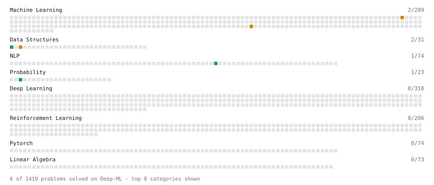

# Deep-ML

My machine learning practice from [Deep-ML](https://www.deep-ml.com). Every solution here was written by hand.

**4** solved · 4 problems · 0 labs · 0 math

[**Browse the interactive portfolio**](https://azizjon0.github.io/deep-ml/) to replay this filling in over time.

## Problems

| | Difficulty | Solved | |
| --- | --- | --- | --- |
| [Min-Max Scaling of Feature Values](https://www.deep-ml.com/problems/112) | easy | 2026-09-15 | [solution](problems/0112-min-max-scaling-of-feature-values) |
| [Poisson Distribution Probability Calculator](https://www.deep-ml.com/problems/81) | easy | 2026-09-15 | [solution](problems/0081-poisson-distribution-probability-calculator) |
| [Numerical Gradient Checking](https://www.deep-ml.com/problems/313) | medium | 2026-09-16 | [solution](problems/0313-numerical-gradient-checking) |
| [Outlier Detection and Removal Using IQR Method](https://www.deep-ml.com/problems/355) | medium | 2026-09-17 | [solution](problems/0355-outlier-detection-and-removal-using-iqr-method) |

---

_This file is regenerated by Deep-ML on every push._
